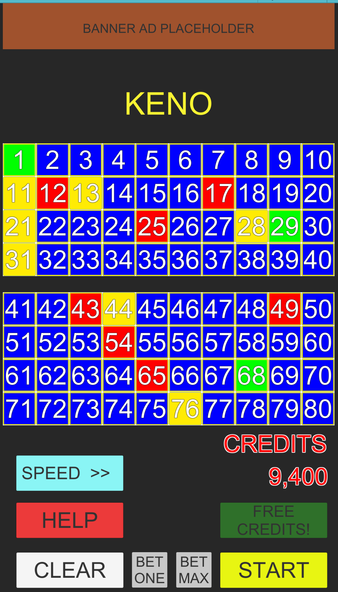

# Keno Game

Keno Game built with Unity UI

This is a VERY early prototype and proof of concept, but you can play it [here](https://rskala.itch.io/keno?secret=QaCAi6HpFPCFKl7rWrEj2NSc)!  
It works on desktop web browsers and mobile!

#

This was an experimental project I toyed around with in order to practice using Unity's UI system (pre-UI Toolkit). I went to Vegas around that time and saw a lot of people playing Keno video poker, and I thought that would be a great game to easily implement in Unity's UI system. There's a bit of placeholder things (such as the "banner ad" at the top), and of course it's exclusively programmer art, but the game itself is functional! 

I named the repo **Keno Game OG** because this is quite old -- like, maybe early 2018 or earlier. I forgot about it, and then happened to find it on an old external SSD I found in a drawer! So, I decided to load it up in Unity 2022, and it surprisingly worked after only a couple minor fixes. I might complete it one of these days, just for fun. 

You can play this prototype on [itch.io](https://rskala.itch.io/keno?secret=QaCAi6HpFPCFKl7rWrEj2NSc) !

#

